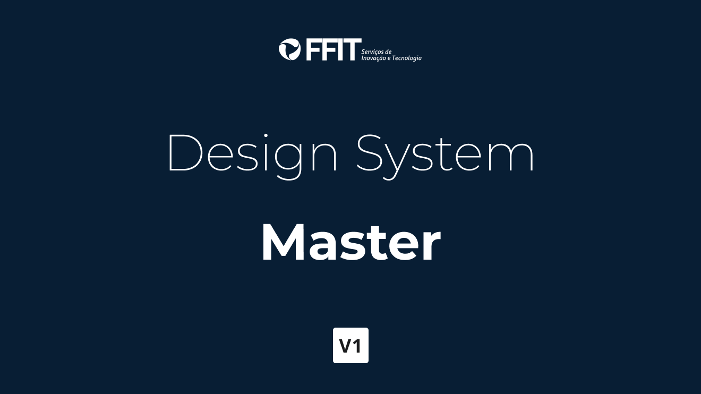

# FFIT Design Tokens

Esse projeto encapsula as **tokens** que os designs definiram para que possam ser usadas em diversos projetos da [FFIT](https://link).

Mas o que seriam _Design Tokens_?

> Os Design tokens são coleções de atributos visuais que geralmente hard-coded, como valores hexadecimais, valores de espaços, medidas, etc). Isso permite que o sistema de design permaneça escalável e consistente, além de aumentar ainda mais a customização dos sistemas deles.

## Tecnologias usadas

- JavaScript: Linguagem de script para páginas Web.
- [TypeScript](https://www.typescriptlang.org/): TypeScript is an open-source language which builds on JavaScript, one of the world’s most used tools, by adding static type definitions.
- [Node](https://nodejs.org/en/): Node.js® is a JavaScript runtime built on Chrome's V8 JavaScript engine.
- [Theo](https://www.npmjs.com/package/theo): Theo is an abstraction for transforming and formatting Design Tokens.

## TODO

- [ ] Como suar.
- [ ] Para quem é esse projeto?
- [ ] Póximos passos.
